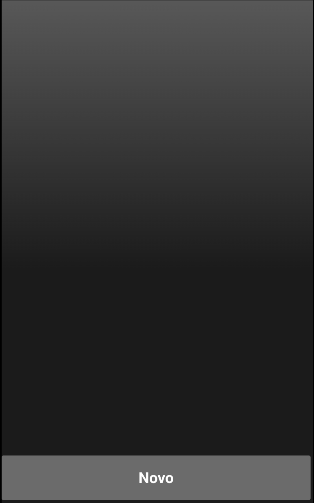
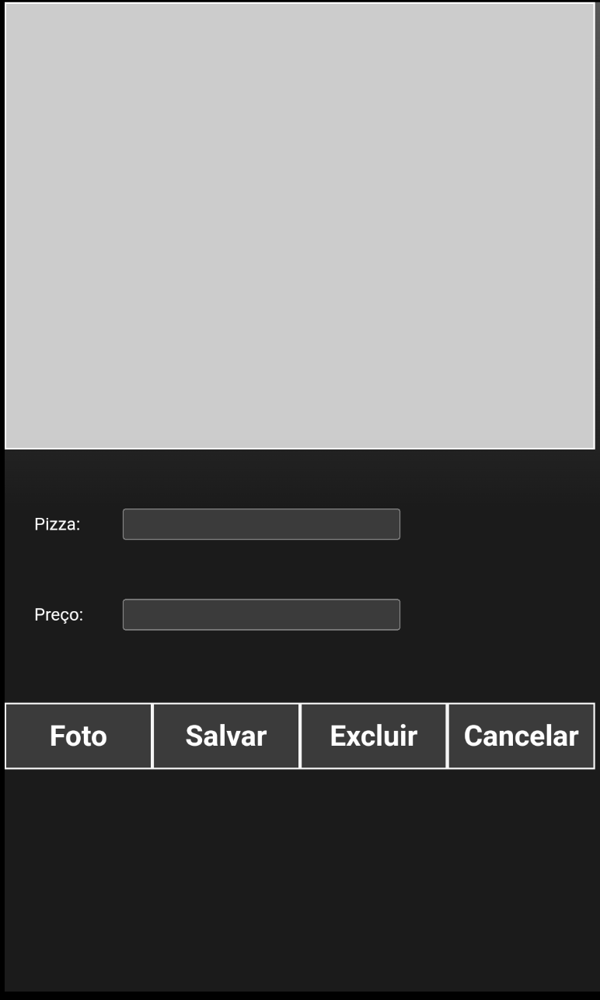

## Trabalho 01 - Cordova - Administração da Pizzaria

- Seguir o roteiro abaixo para criar uma interface administrativa para a pizzaria

- O trabalho deve ser individual

- Efetuar a entrega por meio do canvas enviando **APENAS** os arquivos **index.js** e **index.html**

### Criar o projeto

`cordova create pizzaria-admin pizzaria.admin PizzariaAdminApp`

- Alterar a política de segurança dentro de `index.html`:

`<meta http-equiv="Content-Security-Policy" content="default-src 'self' data: https://ssl.gstatic.com 'unsafe-eval'; style-src 'self' 'unsafe-inline'; media-src *; img-src * data: content:;">
`

- Utilizar o `css` abaixo:
```
body {
    -webkit-touch-callout: none;
    -webkit-text-size-adjust: none;
    background-color:#E4E4E4;
    font-family: system-ui, -apple-system, -apple-system-font, 'Segoe UI', 'Roboto', sans-serif;
    font-size:12px;
    height:100vh;
    margin:0px;
    padding:0px;
    padding: env(safe-area-inset-top, 0px) env(safe-area-inset-right, 0px) env(safe-area-inset-bottom, 0px) env(safe-area-inset-left, 0px);
    width:100%;
}

.app-lista {
    margin-top: 10px;
    display: flex;
    flex-direction: column;
    width:99%;
    height: 95%
}

.superior {
    flex: 10;
    overflow: auto;
}

.inferior {
    flex: 1;
}

.linha {
    position: relative;
    padding: 10px;
    border: solid;
    font-size: 20px;
}

.botao-novo {
    width: 100%;
    height: 99%;
    font-size: 20px;
    font-weight: bold;
}

.app-cadastro {
    display: none;
    flex-direction: column;
    width:99%;
    height: 90%
}

.imagem {
    flex: 4;
    border: solid;
    background-color: #cccccc;
    background-repeat: no-repeat;
    background-position: center;
    background-size: cover;
}

.form {
    flex: 4;
}

.form-linha {
    display: flex;
    align-items: center;
    margin-top: 10%;
    margin-left: 5%;
    margin-right: 5%;
}

.form-linha-esq {
    flex: 1;
}

.form-linha-dir {
    flex: 5;
}

.botoes {
    padding-top: 50px;
    flex: 1;
    display: flex;
    flex-direction: row;
}

.botao {
    flex: 1;
    padding: 10px;
    font-size: 20px;
    font-weight: bold;
    border: solid whitesmoke;
}
```

### Tela Lista das Pizzas Cadastradas

- Elaborar a interface abaixo que exibirá a lista das pizzas já cadastradas e permitir que novas pizzas sejam adicionadas à base de dados da pizzaria
- Neste momento somente desenvolver a interface, deixando para depois a implementação da regra de negócio



- Dicas:
    - Criar uma `div` com `class="app-lista"` e `id="applista"` para conter a listagem das pizzas já cadastradas
    - Dentro da `div applista` criar uma `div` com `class="superior"` e `id="listaPizzas"`
    - Dentro da `div applista` criar outra `div` com `class="inferior"`
    - Dentro da `div class="inferior"` criar um botão com `class="botao-novo"` `id="btnNovo"`

### Tela Cadastro de Novas Pizzas

- Elaborar a interface abaixo para cadastro de novas pizzas
- Neste momento somente desenvolver a interface, deixando para depois a implementação da regra de negócio



- Dicas:
    - Para ocultar a tela anterior (lista das pizzas cadastradas) basta definir no `css` o atributo `display: none` (ao invés de `flex`) da classse `.app-lista` 
    - Criar uma `div` com `class="app-cadastro"` e `id="appcadastro"` para conter a tela de cadastro
    - Criar um `div` interno ao `appcadastro` com `class="imagem"` e `id="imagem"` para conter a imagem da pizza
    - Criar um `div` interno ao `appcadastro` com `class="form"` para os campos de cadastro
    - Dentro do `div class="form"` criar um `div` com `class="form-linha"` e dentro dele:
        - Um `div` com `class="form-linha-esq"` contendo o texto **Pizza:**
        - Um `div` com `class="form-linha-dir"` contendo um `input` com `id=pizza`
    - Dentro do `div class="form"` criar outro `div` com `class="form-linha"` e dentro dele:
        - Um `div` com `class="form-linha-esq"` contendo o texto **Preço:**
        - Um `div` com `class="form-linha-dir"` contendo um `input` com `id=preco`
    - Criar um `div` com `class="botoes"` contendo 4 botões com `class="botao"`:
        - Botão `id="btnFoto"` com o texto **Foto**;
        - Botão `id="btnSalvar"` com o texto **Salvar**;
        - Botão `id="btnExcluir"` com o texto **Excluir**;
        - Botão `id="btnCancelar"` com o texto **Cancelar**;

### Lógica Negócio Cadastro de Novas Pizzas

- Incluir a seguinte instrução `cordova.plugin.http.setDataSerializer('json');` dentro da função `onDeviceReady`
- O botão `id="btnCancelar"` deve fechar a tela de cadastro e retornar para a listagem das pizzas já cadastradas:
    - Para alternar estre as telas a serem exibidas utilizar via *javascript*:
        ```
        applista.style.display = 'flex'; // exibe lista
        appcadastro.style.display = 'none'; // oculta cadastro
        ```
- O botão `id="btnFoto"` deve acionar a câmera para que a foto da pizza seja criada (vide exemplo dado em aula). A imagem deve ser exibida no `div id="imagem"`
- O botão `id="btnSalvar"` deve efetuar o cadastro da pizza por meio de um **POST** no endpoint `https://pedidos-pizzaria.glitch.me/admin/pizza/` contendo no corpo da requisição:

    ```
    pizzaria: PIZZARIA_ID, 
    pizza: pizza.value, 
    preco: preco.value, 
    imagem: imagem.style.backgroundImage
    ```
- **PIZZARIA_ID** deve identificar a sua pizzaria, por exemplo, *pizzaria_do_ze*
- Para testar se a pizza foi inserida corretamente basta efetuar uma requisição no navegador para a URL `https://pedidos-pizzaria.glitch.me/admin/pizzas/PIZZARIA_ID` trocando o **PIZZARIA_ID** para o nome de sua pizzaria
- O botão `id="btnExcluir"` deve efetuar a exclusão da pizza efetuando uma requisição **DELETE** para a URL `https://pedidos-pizzaria.glitch.me/admin/pizza/PIZZARIA_ID/NOME_PIZZA` trocando o **PIZZARIA_ID** para o nome de sua pizzaria e **NOME_PIZZA** pelo nome da pizza a ser excluída

### Lógica Negócio Lista das Pizzas Cadastradas

- Criar uma variável global `listaPizzasCadastradas` para armazenar a lista das pizzas
- Criar uma função `carregarPizzas` para montar a lista das pizzas já cadastradas
    - Efetuar um **GET** no endpoint `https://pedidos-pizzaria.glitch.me/admin/pizzas/' + PIZZARIA_ID` trocando o **PIZZARIA_ID** para o nome de sua pizzaria
    - Caso o `response.data` seja diferente de "" (vazio) então `listaPizzasCadastradas = JSON.parse(response.data);`
    - Percorrer a variável `listaPizzasCadastradas` para montar a lista na tela:
        ```
        listaPizzasCadastradas.forEach((item, idx) => {

            const novo = document.createElement('div');
            novo.classList.add('linha');
            novo.innerHTML = item.pizza;
            novo.id = idx;
            novo.onclick = function () {
                carregarDadosPizza (novo.id);
            };
            
            listaPizzas.appendChild(novo);
        });
        ```

    - Criar uma função `carregarDadosPizza (id)` que receberá o `id` correspondente ao índice da pizza dentro do *array* `listaPizzasCadastradas`:
        - Exibir a tela de cadastro de pizza
        - Trocar a imagem da pizza `imagem.style.backgroundImage = listaPizzasCadastradas[id].imagem`, o nome e o preço da pizza;
    - Caso o usuário clique novamente em **Salvar** efetuar um **PUT** no endpoint `https://pedidos-pizzaria.glitch.me/admin/pizza/` contendo no corpo da requisição:

    ```
    pizzaid: _id_pizza, 
    pizzaria: PIZZARIA_ID, 
    pizza: pizza.value, 
    preco: preco.value, 
    imagem: imagem.style.backgroundImage
    ```
    