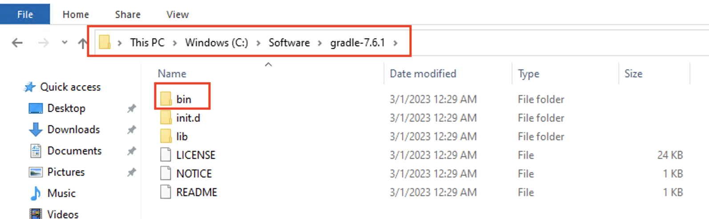
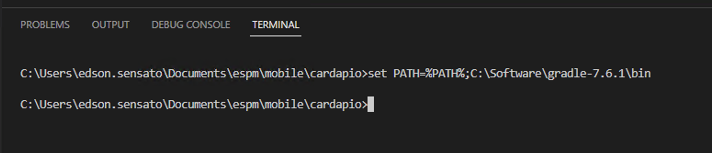
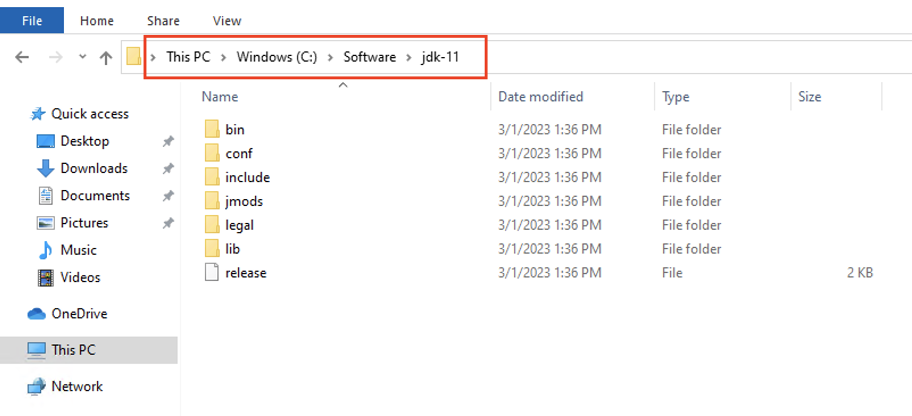
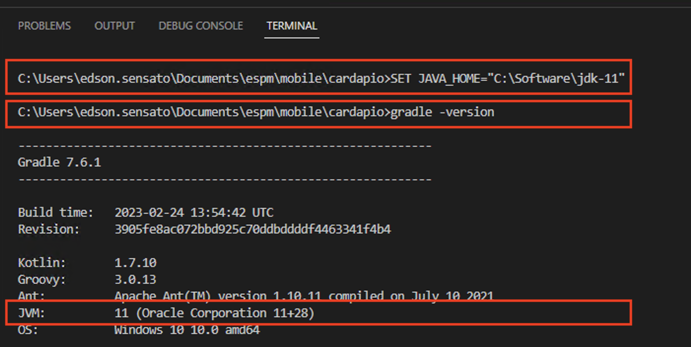
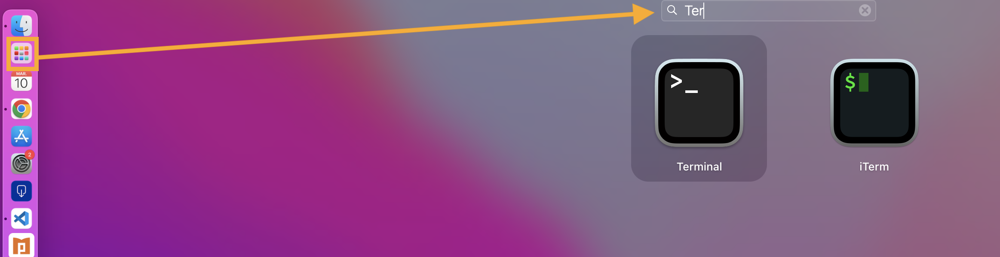

# mobile-2023-01

### Softwares Básicos

- [Nodejs](https://nodejs.org/en/download/)

- [VS Code](https://code.visualstudio.com/download)

- [Android Studio](https://developer.android.com/studio)

- [Gradle](https://gradle.org/releases/)

- Incluir o Gradle no `PATH`

    - Windows: set PATH=%PATH%;Diretório bin do gradle

- Exemplo (Windows)

- `set PATH=%PATH%;C:\Software\gradle-7.6.1\bin`


### Correção Versão do Java - Windows

- Efetuar o download do [Java 11 Windows](https://download.java.net/java/ga/jdk11/openjdk-11_windows-x64_bin.zip)

- Descompactar o arquivo zip em alguma pasta:

- Alterar o `JAVA_HOME` apontando para o diretório acima:

    - `SET JAVA_HOME="C:\Software\jdk-11"`

- Verificar a versão da JVM executando `gradle -v`


### Instalação Completa Mac

- Abrir um **Terminal**



- Criar uma pasta `mobile/software`:
    - `cd ~`
    - `mkdir mobile`
    - `cd mobile`
    - `mkdir software`
    - `cd software`

- Efetuar o download do **Java 11 para Mac**
    - `curl https://download.java.net/java/ga/jdk11/openjdk-11_osx-x64_bin.tar.gz --output openjdk-11_osx-x64_bin.tar.gz`

- Descompactar o arquivo
    - `tar xvf openjdk-11_osx-x64_bin.tar.gz`

- Remover o zip
    - `rm openjdk-11_osx-x64_bin.tar.gz`

- Adicionar o **JAVA_HOME** no *profile*
    - `echo "export JAVA_HOME=~/mobile/software/jdk-11.jdk/Contents/Home" >> ~/.zshrc`

- Efetuar o download do **Gradle**
    - `https://services.gradle.org/distributions/gradle-8.0.2-bin.zip`

- Salvar na pasta `mobile/software`

- Descompactar o arquivo
    - `unzip gradle-8.0.2-bin.zip`

- Remover o zip
    - `rm  gradle-8.0.2-bin.zip`

- Adicionar o **Gradle** ao `PATH`
    - `echo "export PATH=$PATH:~/mobile/software/gradle-8.0.2/bin" >> ~/.zshrc`

- Verificar a versão do Java no **Gradle** abrindo um novo terminal dentro do **VS Code**


### Problema Dimensão AVD Windows

- [Vide](https://stackoverflow.com/questions/44013216/android-emulator-screen-size-not-the-same-as-device-frame)

### Instalação Cordova

`npm install -g cordova`

`cordova -v`

### Criando um Projeto

`cordova create cardapio pizzaria.cardapio CardapioApp`

- create: cria um projeto Cordova;
- cardapio: pasta onde o projeto será criado
- pizzaria.cardapio: pacote onde o código será gerado
- CardapioApp: nome do app

### Adicionando Plataformas

Acessar o diretório em que o projeto foi criado

`cordova platform add android`

- Opções: IOS, windows, browser...

### Executando

- No emulador (AVD)

`cordova run android`

- No navegador

`cordova run browser -lc --target=chrome`

### Eventos

- **Atenção!** Não remover a tag `<div id="deviceready">`

- Criar um botão:

    `<button id = "msg">Clique Aqui</button>`

- Editar o arquivo `index.js`
```
document.getElementById("msg").addEventListener("click", exibirMensagem); 

let exibirMensagem = () => {
    alert('Olá');
}
```
- Exibir a mensagem dentro de um `<div>` incluir no `index.html`
```
<div class="app">
    <h1>Cardápio</h1>
    <div id="deviceready">
        <button id = "msg">Clique Aqui</button>
    </div>
    <div id="conteudo"></div>
</div>
```
- Alterar a função dentro de `index.js`
```
let exibirMensagem = () => {
    document.getElementById("conteudo").innerHTML = 'Olá';
}
```

#### Entrada de Dados

`<div id="form"><input type="text" id="texto"></div>`

```
let exibirMensagem = () => {
    let txt = document.getElementById("texto").value;
    document.getElementById("conteudo").innerHTML = txt;
}
```

- Obs: para manter o posicionamento da interface ao abrir o teclado, ajustar o arquivo `AndroidManifest.xml` e incluir a propriedade `android:windowSoftInputMode="adjustPan"` na tag `<activity>`

### Estilos

- Estilos podem ser editados na pasta `css`, por exemplo, o `index.css`

```
.app {
    display: flex;
    flex-direction: column;
    width:100%
}
```

### Sistema de Pedidos de Pizza

- Criar um app para efetuar o pedido de pizza

#### Interface

- Titulo

```
<div class="titulo">Pizzaria Cordova</div>

.titulo {
    font-size:24px;
    font-weight: bold;
    margin:0px;
    padding-top:10px;
    padding-bottom:10px;
    text-align:center;
    width: 100%;
}
```

- Imagem da Pizza

```
<div class="imagem-container">
    <div class="imagem-lateral"><div class="seta" id="esquerda">&lt;&lt;</div></div>
    <div class="imagem" id="imagem"></div>
    <div class="imagem-lateral"><div class="seta" id="direita">&gt;&gt;</div></div></div>    
</div>

.imagem-container {
    display: flex;
    align-items: center;
}

.imagem-lateral {
    flex: 1;
}

.imagem {
    flex: 3;
    border: solid;
    height: 200px;
}

.seta {
    font-size: 34px;
    text-align: center;
}
```

- Exibindo as imagens

```
background-image: url("../img/pizza.jpg");
background-color: #cccccc;
background-repeat: no-repeat;
background-position: center;
background-size: cover;
```

### Imagens Externas

- Alterar em `index.html` a diretiva de segurança `img-src`:

```
<meta http-equiv="Content-Security-Policy" 
content="default-src 'self' data: https://ssl.gstatic.com 'unsafe-eval'; style-src 'self' 'unsafe-inline'; media-src *; img-src * data: content:;">
```

- Formulário do Pedido

```
<div class="form-linha">
    <div class="form-linha-esq">Local:</div>
    <div class="form-linha-dir"><input type="text" id="endereco"></div>
</div>

<div class="form-linha">
    <div class="form-linha-esq">Pizza:</div>
    <div class="form-linha-dir" id="pizza">Calabresa com Cebola</div>
</div>

<div class="form-linha">
    <div class="form-linha-esq">Preço:</div>
    <div class="form-linha-dir" id="preco">R$ 35,00</div>
</div>

<div class="form-linha">
    <div class="form-linha-esq">Qtde:</div>
    <div class="form-linha-dir"><select id="qtde"><option value="1">1</option></select></div>
</div>

.form-linha {
    display: flex;
    align-items: center;
    margin-top: 10%;
    margin-left: 5%;
    margin-right: 5%;
}

.form-linha-esq {
    flex: 1;
}

.form-linha-dir {
    flex: 5;
}
```

- Botão Enviar

```
<div class="form-linha">
    <button class="enviar" id="enviar">Enviar</button>
</div>

.enviar {
    width: 100%;
    padding-top: 10px;
    padding-bottom: 10px;
}
```

#### Lógica do Negócio

- Criação das variáveis para referenciar os elementos da interface

```
const itensCardapio = [{pizza: "Calabresa", preco: "R$ 25,00", imagem: "../img/pizza.jpg"},
{pizza: "Quatro Queijos", preco: "R$ 35,00", imagem: "../img/pizza.jpg"}];

var idItem = 0;
var endereco;
var qtde;
var preco;
var imagem;
var pizza;
```

- Referenciar os elementos da interface

```
endereco = document.getElementById('endereco');
qtde = document.getElementById('qtde');
preco = document.getElementById('preco');
imagem = document.getElementById('imagem');
pizza = document.getElementById('pizza');
```

- Criar uma função para atualizar a interface e chamá-la no `onDeviceReady`

```
const atualizarInterface = () => {
    pizza.innerHTML = itensCardapio[idItem].pizza;
    preco.innerHTML = itensCardapio[idItem].preco;
    imagem.style.backgroundImage = itensCardapio[idItem].imagem;
}
```

- Mover para a direita

```
const direita = () => {
    if (idItem < itensCardapio.length) {
        idItem++;
    }
    atualizarInterface();
}
```

- Mover para a esquerda

```
const esquerda = () => {
    if (idItem > 0) {
        idItem--;
    }
    atualizarInterface();
}
```

- Enviar dados

```
const enviar = () => {
    alert (endereco.value + " - " + itensCardapio[idItem].pizza + " - " + qtde.value); 
}
```

#### Requisições HTTP

- Instalar o plugin `cordova plugin add cordova-plugin-advanced-http`

- Alterar em `index.html` a diretiva de segurança `default-src`:

```
<meta http-equiv="Content-Security-Policy" 
content="default-src * data: https://ssl.gstatic.com 'unsafe-eval'; style-src 'self' 'unsafe-inline'; media-src *; img-src * data: content:;">
```

- Executando **GET**

```
const request = () => {
    cordova.plugin.http.get('https://pedidos-pizzaria.glitch.me/ping', {
}, {}, function(response) {
  // para converter a resposta em JSON
  console.log(JSON.parse(response.data));
  alert(response.data);
}, function(response) {
  alert(response.error);
});

}
```
- Executando **POST**
```
cordova.plugin.http.setDataSerializer('json');
cordova.plugin.http.post('https://pedidos-pizzaria.glitch.me/', {
  pizza: "Atum com Queijo", quantidade: 1, endereco: "Rua das Rosas, 123"
}, {}, function(response) {
  alert(response.status);
}, function(response) {
  alert(response.error);
});
```
- Conferir os pedidos realizados:

    `https://pedidos-pizzaria.glitch.me/`

#### Exercícios

- Atuaizar o POST para enviar os dados preenchidos pelo usuário
- Obter o caradápio dinamicamente efetuando um GET no endpoint e atualizando os dados no app ao invés de utilizar a variável *hardcoded* `itensCardapio`

    `https://pedidos-pizzaria.glitch.me/pizzas`

#### Plugins

- Mecanismos de extensão da plataforma - vide [Referência](https://cordova.apache.org/plugins/)

#### Splash Screen

- Instalar o *plugin*:

    `cordova plugin add cordova-plugin-splashscreen`

- Configurar a imagem no arquivo `config.xml`
    ```
    <platform name="android">
        <splash src="res/screen/android/pizza.png"/>
        <preference name = "SplashScreenDelay" value = "3000" />
    </platform>
    ```
- O caminho da imagem deve ser relativo à raiz do projeto (pasta `res` no mesmo nível de `www`, por exemplo)

#### Câmera

- Criar um novo projeto

    `cordova create foto tirar.foto FotoApp`

- Entrar no diretório do projeto

    `cd foto`

- Instalar o plugin:

    `cordova plugin add cordova-plugin-camera`

- Adicionar a plataforma

    `cordova platform add android`

- CSS

    ```
    body {
        -webkit-touch-callout: none;
        -webkit-text-size-adjust: none;
        background-color:#E4E4E4;
        font-family: system-ui, -apple-system, -apple-system-font, 'Segoe UI', 'Roboto', sans-serif;
        font-size:12px;
        height:100vh;
        margin:0px;
        padding:0px;
        padding: env(safe-area-inset-top, 0px) env(safe-area-inset-right, 0px) env(safe-area-inset-bottom, 0px) env(safe-area-inset-left, 0px);
        width:100%;
    }

    .app {
        margin-top: 10px;
        display: flex;
        flex-direction: column;
        width:99%;
        height: 95%
    }

    .preview {
        flex: 5;
        border: solid
    }

    .botao {
        flex: 1;

    }

    .tirar {
        width: 100%;
        padding: 10px;
        margin-top: 10px;
        font-size: 20px;
    }
    ```

- Incluir um botão para acionar a câmera e o local para exibir a imagem

    ```
    <div class="app">
        <div class="preview" id="preview"></div>
        <div class="botao"><button class="tirar" id="tirarfoto">Tirar Foto</button></div>
    </div>
    ```

- Registrar o evento de `click` no botão que vai acionar a câmera

    ```
    document.getElementById('tirarfoto').addEventListener('click', tirarFoto);
    ```

- Definir a função para efetuar a captura da imagem e exibir no `preview`
    ```
    const tirarFoto = () => {
        navigator.camera.getPicture(onSuccess, onFail, {  
            quality: 50, 
            destinationType: Camera.DestinationType.DATA_URL 
        });  
        
        function onSuccess(imageData) { 
            preview.style.backgroundImage = "url('data:image/jpeg;base64," + imageData + "')"; 
        }  
        
        function onFail(message) { 
            alert('Failed because: ' + message); 
        } 
    ```
- Exemplo para envio a um endpoint via POST:
    ```
    const enviarFoto = () => {

    cordova.plugin.http.setDataSerializer('json');
    cordova.plugin.http.post('https://pedidos-pizzaria.glitch.me/imagem', {
    imagem: "data:image/jpeg;base64," + dadoImagem
    }, {}, function(response) {
    alert(response.status);
    }, function(response) {
    alert(response.error);
    });
    }
    ```
- Conferir as imagens em `https://pedidos-pizzaria.glitch.me/imagem`