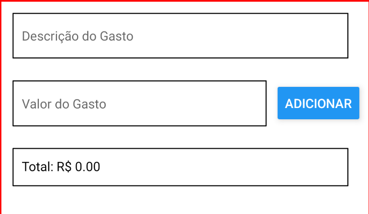

## React Native - Aula 01

- [NodeJs Download](https://nodejs.org/en/download)
- [React Native](https://reactnative.dev/)
- [VS Code](https://code.visualstudio.com/download)
- [Android Studio / SDK](https://developer.android.com/studio)

- Componentes visuais do React Native são compilados nativamente para as respectivas plataformas (iOS, Android, etc...)
- Lógica de negócio permanece em *JavaScript*

### Configuração do Ambiente

- [Instalação CLI - Expo](https://reactnative.dev/docs/environment-setup):
  - `npm install --location=global --loglevel=error expo-cli`
  - Caso não dê certo, tentar com `npm install -g expo-cli`
  - Obs **Mac**:
    - `sudo npm install --location=global --loglevel=error expo-cli`
### Criação do Projeto
- Criar o projeto utilizando o CLI [Expo](https://expo.dev/)
- `expo init ControleGastos`
- Escolher blank como modelo (para Mac `sudo npm install`
    ```
    cd ControleGastos
    npm install
    npm run android
    ```
- Pasta `assets` pode ser utilizada para armazenar imagens utilizadas pelo app
- Arquivo `App.js` contém o código fonte
- Principais blocos: 
    - import
    - código
    - estilos
- Função `App()`indica o ponto de entrada do app
- O retorno desta função deve representar o desenho da interface de usuário que será convertida para eleentos nativos na plataforma específica (ios, android, web, etc...)
    ```javascript
    export default function App() {
        return null;
    }
    ```
- [Lista dos Componentes Visuais e APIs](https://reactnative.dev/docs/components-and-apis)
***
#### `<Text>`
- Importar `import { Text } from 'react-native';`
- Exibe um texto estático
- Podem ser utlizadas expressões dentro do texto
- Para processar expressões é necessário utilizar os símbolos `{` e `}`
- Por exemplo:
    ```javascript
    export default function App() {
    var variavel = 'Ok!'
    return <Text>Tudo certo = {variavel}, 2 + 2 = {2 + 2}</Text>
    }
    ```
- Estilos podem ser aplicados localmente `style={{margin: 100}}`
    ```javascript
    export default function App() {
        var variavel = 'Ok!'
        return <Text style={{margin: 100}}>Tudo certo = {variavel}, 2 + 2 = {2 + 2}</Text>
    }
    ```
***
#### `<View>`
- Importar `import { View } from 'react-native';`
- Representa um container para demais componentes React onde estilos podem ser aplicados globalmente
    ```javascript
    export default function App() {
    var variavel = 'Ok!'
    const texto = () => {
        return "Boa noite!";
    }
    return <View style={{margin: 100, borderWidth: 5}}>
                <Text>Tudo certo = {variavel}</Text>
                <Text>2 + 2 = {2 + 2}</Text>
                <Text>{texto()}</Text>
            </View>
    }
    ```
***
#### Estilos
- Importar `import { StyleSheet } from 'react-native';`
- Utilizar o método utilitário `StyleSheet.create` para criar objetos de estilo
- São "semelhantes" ao **css** mas não são iguais!!!!
    ```javascript
    const styles = StyleSheet.create({
    container: {
        flex: 1, // ocupa toda a dimensão vertical
        marginTop: '10%',
        borderWidth: 5,
        borderColor: 'red'
    }});
    ```
- Referenciar com a propriedade `style={objeto_estilo.nome_estilo}`
    ```javascript
    export default function App() {
    var variavel = 'Ok!'
    return <View style={styles.container}>
                <Text>Tudo certo = {variavel}</Text>
                <Text>2 + 2 = {2 + 2}</Text>
            </View>
    }
    ```
***
#### Controle de Estado em React
- Controle de estado é um conceito fundamental em **React**
- Estado representa o valor das variáveis em um determinado momento
- Caso o estado de uma variável seja alterado internamente pode-se desejar que esta alteração seja refletida na interface de usuário
    ```javascript
    export default function App() {

    let contador = 0;
    const contar = () => {
        contador++;
    }

    return <View style={styles.container}>
            <Text style={{textAlign: 'center'}}>{contador}</Text>
            <Button title='Contar' onPress={contar}/>
            </View>
    }
    ```
- O exemplo acima não funciona, o contador não é atualizado na interface
- Para que isso seja feito é necessário o uso do `useState`
```javascript
  import { useState } from 'react';
  // variável contador somente leitura
  // para alterar seu valor utilizar a função incContador
  const [contador, incContador] = useState(0);

  const contar = () => {
    // atribuir o valor atual de contador a outra variável
    let newContador = contador;
    // atualizar o novo valor utilizando o incContador
    incContador(++newContador);
  }
```
***
#### `<TextInput>`
- Importar `import { TextInput } from 'react-native';`
- Permite a entrada de um texto
- Deve ser associado a uma variável de estado `useState`
- Principais propriedades:
  - `style` - define o estilo
  - `onChangeText` - associado à função de controle de estado (`useState`)
  - `value` - valor digitado e associado à variável de estado (`useState`)
 #### Exemplo `<TextInput>`
- Importar controle de estado do React: `import { useState } from 'react';`
- Criar uma variável de estado chamada `descricaoGasto`
  ```javascript
  const [descricaoGasto, onChangeDescricaoGasto] = useState('');
  ```
- Criar um manipulador para o texto inserido:
  ```javascript
  const descricaoGastoHandler = (texto) => {
    console.log(texto);
    onChangeDescricaoGasto(texto);
  }
  ```
- Definir o `<TextInput>`:
  ```javascript
  <TextInput style={styles.input} 
             value={descricaoGasto} 
             onChangeText={descricaoGastoHandler}
             placeholder="Descrição do Gasto"/>
  ```
- Definir o estilo:
  ```css
  input: {
    height: 40,
    margin: 12,
    width: 300,
    borderWidth: 1,
    padding: 10,
  },
  ```
***
#### Exibindo o Texto Digitado
- Criar o `<Text>`:
  ```
  <Text>{descricaoGasto}</Text>
  ```
#### `<Button>`
- Importar `import { Button } from 'react-native';`
- Botão que pode ser pressionado
- Principais propriedades:
  - `style` - define o estilo
  - `onPress` - função acionada quando o botão é pressionado
  - `title` - rótulo do botão
***
#### Exemplo `<Button>`
- Criar um `<Button>`
  ```javascript
  <Button title="Adicionar" onPress={addDescricaoGastoHandler}/>
  ```
- Criar um manipulador a ser acionado quando o botão for pressionado:
  ```javascript
  const addDescricaoGastoHandler = () => {
    console.log(descricaoGasto);
  }
  ```
***
#### Armazenar Gastos em Uma Lista
- **Nota:** como concatenar *arrays* em *Javascript* utilizando **spread** (`...`)
    ```javascript
    const letras = ["A", "B", "C"];
    const maisLetras = [letras, "D"];
    console.log(maisLetras);
    ```
- Resultado: `[["A", "B", "C"], "D"]` - um *array* dentro de outro
    ```javascript
    console.log(...letras)
    ```
- Concatenação com o **spread** (`...`):
    ```javascript
    const maisLetras = [...letras, "D"];
    console.log(maisLetras)
    ```
- **Nota:** utilizando `map` para percorrer elementos de um *array*
    ```javascript
    maisLetras.map((item) => console.log(item))
    ```
- Criar uma variável de estado para armazenar a lista de gastos:
    ```javascript
    const [listaGastos, setListaGastos] = useState([]);
    ```
- Alterar a função acionada quando o botão é pressionado:
  ```javascript
  const addDescricaoGastoHandler  = () => {

    setListaGastos((gastosAtuais) => {
      console.log([...gastosAtuais, descricaoGasto]);
      return [...gastosAtuais, descricaoGasto];
    });
  }
  ```
- Os itens devem ser exibidos em uma lista contento `<Text>` para cada elemento
- Utilizar a função `map` do javascript para percorrer os elementos da lista
```javascript
{listaGastos.map((gasto) => <Text key={gasto}>{gasto}</Text>)}
```
***
### FlexBox
- Permite distribuir os componentes visuais proporcionalmente na área de visualização
- A propriedade `flexDirecion` define como os componentes dentro da `<View>` serão distribuídos
  - `row`: alinhados lado a lado (linha)
  - `column`: alinhados um abaixo do outro (coluna) - *Default*
- Cada componente dentro da `<View>` tem uma propriedade `flex` para indicar o quanto de espaço irá ocupar
- No exemplo baixo, 1 + 4 = 5, então **Item 1** irá ocupar 1/5 do espaço horizontal
- Já o **Item 2** irá ocupar 4/5
  ```javascript
  <View style={{marginTop: 50, flexDirection:'row'}}>
      <Text style={{flex: 1, borderColor: 'red', borderWidth: 1}}>Item 1</Text>
      <Text style={{flex: 4, borderColor: 'red', borderWidth: 1}}>Item 2</Text>
  </View>
  ```
***
#### Ajustando o Layout Atual
- Efetuar a refatoração dos elementos adicionando os estilos e aplicando o **flex**
    ```javascript
    return <View style={styles.container}>
                <TextInput style={styles.input} 
                value={descricaoGasto} 
                onChangeText={descricaoGastoHandler}
                placeholder="Descrição do Gasto"/>
                <Button style={styles.button} title="Adicionar" 
                onPress={addDescricaoGastoHandler}/>
                <View style={styles.lista}>
                {listaGastos.map((gasto) => <Text key={gasto}>{gasto}</Text>)}
                </View>
            </View>
    }
    ```
- Estilos:
    ```javascript
    const styles = StyleSheet.create({
    container: {
        flex: 1, // ocupa toda a dimensão vertical
        marginTop: '10%',
        borderWidth: 5,
        borderColor: 'red'
    },
    input: {
        margin: 12,
        flex: 1,
        borderWidth: 1,
        padding: 10,
    },
    button: {
        flex: 1
    },
    lista: {
        flex: 20,
        margin: 10
    }
    ```
- Colocar o `<Button>` ao lado do `<TextInput>`
- Utilizar `<View>` para criar agrupamento dos componentes visuais do app
    ```javascript
    <View style={{marginRight: 10, flexDirection: 'row', alignItems: 'center'}}>
    <TextInput style={styles.input} 
    value={descricaoGasto} 
    onChangeText={descricaoGastoHandler}
    placeholder="Descrição do Gasto"/>
    <Button style={styles.button} title="Adicionar" onPress={addDescricaoGastoHandler}/>
    </View>
    ```
***
#### `<Image>`
- Importar `import { Image } from 'react-native';`
- Permite incluir imagens
- Os arquivos de imagem podem ser armazenados dentro da pasta `assets`
- Exemplo (copiar o arquivo `001-coin.png` para a pasta `assets`):
`<Image source={require('../assets/001-coin.png')}/>`
***
#### `<FlatList>`
- Exibe uma lista de itens de forma otimizada:
  - `data`: lista contendo os valores a serem exibidos
  - `renderItem`: como os itens da lista serão exibidos visualmente - recebe como parâmetro um objeto JSON com os atributos `item` (texto) e `index` (índice do item no *array* mapeado para `data`)
  - `keyExtractor`: chaves únicas para cada item da lista - recebe como parâmetro o índice do elemento no *array* indicado em `data`
***
#### Exibir Gastos na FlatList
- Para organizar o código, criar uma função que retorna o item a ser exibido em cada linha da lista
    ```javascript
  const renderGasto = (item, index) => {
    return <Text style={styles.item}>{item}</Text>;
  }
    ```
- Referenciar a função `renderGasto` para exibir o item de gasto adicionado
    ```javascript
    <FlatList
        data={listaGastos} 
        renderItem={({item, index}) => renderGasto(item, index)}
        keyExtractor={idx => idx} />
    ```
- Definir o estilo para cada item:
    ```css
    item: {
        height: 40,
        marginLeft: 10,
        textAlignVertical: 'center'
    }
    ```
- Obtendo o item selecionado com `onPress`
    ```javascript
    const removerGasto = idx => {
        let removerGasto = [...listaGastos];
        removerGasto.splice(idx,1);
        addListaGastos(removerGasto);
    };

    const renderGasto = (item, index) => {
        return <Text onPress={()=>removerGasto(index)} 
                    style={styles.item}>{item}</Text>;
    }
    ```
***
#### Funções como Componentes React
- A função `renderGasto` deve ter o nome trocado para `RenderGasto`
- Os parâmetros devem ser encapsulados em um único parâmetro `props`
- As propriedades são obtidas de `props` como `props.index` e `props.item`
  ```javascript
    const RenderGasto = (props) => {
      return <Text onPress={()=>removerGasto(props.index)} 
                  style={styles.item}>{props.item}</Text>;
    }
  ```
- Para acionar a função agora encapsulada em um componente:
  ```javascript
  <FlatList
    data={listaGastos} 
    renderItem={({item, index}) => <RenderGasto index={index} item={item}/>}
    keyExtractor={idx => idx} />
  ```
 #### Melhorando o componente `RenderGasto`
 - Incluindo uma `View` e estilo
    - `borderRadius`: arredondamento dos cantos do componente

 ```css
   itemgasto: {
    margin: 8,
    padding: 8,
    borderRadius: 6,
    backgroundColor: '#88ff'
  },
 ```
 - Criar uma `<View>` englobando `<Text>` com o estilo `itemgasto` aplicado

 ```javascript
   const RenderGasto = (props) => {
    return <View style={styles.itemgasto}>
      <Text onPress={()=>removerGasto(props.index)} 
                 style={styles.item}>{props.item}</Text>
      </View>;
  }
  ```
***
### `<Pressable>`
- Uma outra forma de permitir que um componente seja pressionado pelo usuário é utilizando o componente `<Pressable>` ao invés de utilizar a propriedade `onPress` diretamente em um componente visual (como no caso do `<Text>`)
  ```javascript
    const RenderGasto = (props) => {
    return <Pressable onPress={()=>removerGasto(props.index)}>
      <View style={styles.itemgasto}>
      <Text style={styles.item}>{props.item}</Text>
      </View>
      </Pressable>;
  }
  ```
***
### Organizando os Componentes
- Criar uma pasta `components` dentro do projeto
- Criar um arquivo `RenderGasto.js` dentro da pasta
- Neste arquivo, importar os coponentes utilizados pelo `RenderGasto.js`
`import { StyleSheet, Text, View, Pressable } from 'react-native';`
- Mover a função `renderGasto` de `App.js` para `RenderGasto.js`
  ```javascript
  const RenderGasto = (props) => {
      return <Pressable onPress={() => console.log("Remover...")}>
        <View style={styles.itemgasto}>
        <Text style={styles.item}>{props.item} {props.index}</Text>
        </View>
        </Pressable>;
    }
  ```
- Incluir também a folha de estilos:
  ```javascript
  const styles = StyleSheet.create({
    itemgasto: {
      margin: 8,
      padding: 8,
      borderRadius: 6,
      backgroundColor: '#88ff'
    },
    item: {
      height: 40,
      marginLeft: 10,
      textAlignVertical: 'center'
    }
  });
  ```
- Tornar o componente acessível fora do arquivo em que está definido:
`module.exports.RenderGasto = RenderGasto;`
- Em `App` referenciar o componente por meio de `import`
`import { RenderGasto } from './components/RenderGasto'`

- **Problema:** como acionar uma função que não está definida no componente `RenderGasto` para remover um item da lista (gasto)?
- **Solução:** passar uma função como parâmetro (*callback*) assim como `item` e `index` dentro de `props` e acioná-la dentro de `onPress`

  ```javascript
  const RenderGasto = (props) => {
      return <Pressable onPress={() => props.onRemoverGasto(props.index)}>
        <View style={styles.itemgasto}>
        <Text style={styles.item}>{props.item} {props.index}</Text>
        </View>
        </Pressable>;
    }
  ```
- Então passar como parâmetro a função de *callback* `removerGasto` via `onRemoverGasto`
`<RenderGasto onRemoverGasto={removerGasto} index={index} item={item}/>`
## Exercícios
- Transformar o `<TextInput>` e o `<Button>` onde o gasto é adicionado na lista em um componente chamado `RenderEntradaGasto`;
- Criar um componente `TelaPrincipal`, transferir o conteúdo de `App` para ele e ajustar o `App` para conter apenas a referência ao novo componente criado:
  ```javascript
  import TelaPrincipal from './components/TelaPrincipal';

  export default function App() {

    return <TelaPrincipal />

  }
  ```
- Adicionar os campos **Valor** e **Total** no app de Controle de Gastos conforme abaixo:
- 
- No componente `RenderEntradaGasto` criado:
  - Alterar o layout para permitir a entrada do valor do gasto
  - Criar uma nova variável de estado para armazenar o valor do gasto inserido (semelhante ao que foi feito para a descrição do gasto)
  
- Adicionar o valor do gasto em cada gasto inserido na lista
- Inserir uma imagem (ícone de moeda, por exemplo) na linha do gasto
  `<Image source={require('../assets/001-coin.png')}/>`
- Ao inserir ou remover um gasto, atualizar o total de despesas no campo **Total** (somente leitura)
- **EXTRA**: utilizar `<Modal>` para exibir uma janela para avisar que o total de gastos ultrapassou R$ 1.000,00
***
### `<Modal>`
- Exibe uma janela sobreposta (**modal**)
- Principais atributos:
  - `visible`: indica quanto o `Modal` deve ser exibido (utilizar em conjunto com uma variável de estado *true* / *false*)
  - `transparent`: diz que o `Modal` deve ter seu fundo transparente (utlizar *true*)
  ```javascript
  <Modal visible={ exibirModal } transparent={true}>
      <View style={styles.centeredView}>
        <View style={styles.modalView}>
          <Text>Modal</Text>
          <Pressable
      style={[styles.button, styles.buttonClose]}
      onPress={() => setExibirModal(!exibirModal)}>
      <Text style={styles.textStyle}>Fechar</Text>
    </Pressable>
        </View>
      </View>
  </Modal>

  centeredView: {
    flex: 1,
    justifyContent: 'center',
    alignItems: 'center',
    marginTop: 22,
    borderColor: 'red'
  },
  modalView: {
    margin: 20,
    backgroundColor: 'white',
    borderRadius: 20,
    padding: 35,
    alignItems: 'center',
    shadowColor: '#000',
    shadowOffset: {
      width: 0,
      height: 2,
    },
    shadowOpacity: 0.25,
    shadowRadius: 4,
    elevation: 5,
  },
  button: {
    borderRadius: 20,
    padding: 10,
    elevation: 2,
  },
  buttonClose: {
    backgroundColor: '#2196F3'
  }
  ```
***
### Navegação com React Navigation
- [React Navigation](https://reactnavigation.org/docs/getting-started/) é um componente que implementa vários tipos de navegação para aplicações **React Native**
- Instalação dos módulos necessários

  `npm install --save @react-navigation/native`
  
  `npm install --save react-native-screens react-native-safe-area-context`
- Para implementar a navegação é necessário envolver os componentes em um `NavigationContainer`

  `import { NavigationContainer } from '@react-navigation/native';`
  ```javascript
  export default function App() {

    return (<NavigationContainer>
      <TelaPrincipal />
    </NavigationContainer>)

  }
  ```
- Um dos tipos de navegação mais comum é o [Stack Navigator](https://reactnavigation.org/docs/native-stack-navigator)

  `npm install --save @react-navigation/native-stack`
- Criar o `NativeStackNavigator`

  `import { createNativeStackNavigator } from '@react-navigation/native-stack';`
  ```javascript
  const Stack = createNativeStackNavigator();
  ```
- Informar as telas que serão controladas pelo `Stack Navigator`
  ```javascript
  return (<NavigationContainer>
    <Stack.Navigator>
      <Stack.Screen name="principal" component={TelaPrincipal}/>
    </Stack.Navigator>
  </NavigationContainer>)
  ```
- Criar uma segunda tela `TelaDetalhes` que deve ser exibida ao clicar em um gasto na lista e incluí-la no `Stack` com o nome `detalhes`
- A `TelaPrincipal` agora receberá como parâmetro `props` um objeto `navigator` (`TelaPrincipal({ navigator })`)
- Para navegar para outra tela, basta utilizar

`navigator.navigate('detalhes')`
- Pode-se passar parâmetro também entre duas telas

`navigator.navigate('detalhes', {idGasto: props.idx})`
- Na tela destino, o acesso aos parâmetros deve ser feito por meio do componente `route`
  ```javascript
  export default function TelaDetalhe({ route }) {
      const idGasto = route.params.idGasto;
      return <Text>{idGasto}</Text>
  }
  ```
***
### Persistência com SQLite
- É possível persistir dados localmente tanto em Android quando em iOS utilizando o banco de dados relacional **SQLite**

  `expo install expo-sqlite`
- Criar um arquivo `BancoDados.js`
  ```javascript
  import * as SQLite from 'expo-sqlite';

  const bcodados = SQLite.openDatabase('gastos.db');
  ```
  ```javascript
  import * as SQLite from 'expo-sqlite';

  const bcodados = SQLite.openDatabase('gastos.db');

  export const iniciar = () => {

      const retorno = new Promise((resolve, reject) => {

      });

      return retorno;

  }
  ```
  - Criando a estrutura do banco de dados
  ```javascript
  import * as SQLite from 'expo-sqlite';

  const bcodados = SQLite.openDatabase('gastos.db');

  export const iniciar = () => {

      const retorno = new Promise((resolve, reject) => {

          bcodados.transaction((tx) => {

                  tx.executeSql('CREATE TABLE IF NOT EXISTS gastos (id INTEGER PRIMARY KEY NOT NULL, descricao TEXT NOT NULL, valor REAL NOT NULL)',
                  [],
                  () => {
                      resolve();
                  },
                  (_, error) => reject(error));    
              });
      });

      return retorno;

  }
  ```
- Em `App.js`
  ```javascript
  iniciar().then(() => console.log("Iniciado banco de dados")).catch((err) => console.log(err));
  ```
- Inserindo gastos
```javascript
    bcodados.transaction((tx) => {

            tx.executeSql('INSERT INTO gastos (descricao, valor) VALUES (?, ?)',
            [descricao, valor],
            (_, result) => {
                console.log(result)
                resolve(result);
            },
            (_, error) => reject(error));    
        });
```
- Listando gastos
```javascript
    bcodados.transaction((tx) => {

            tx.executeSql('SELECT * FROM gastos',
            [],
            (_, result) => {
                resolve(result.rows._array);
            },
            (_, error) => reject(error));    
        });
```
***
### Requisições HTTP com Axios
- Existem várias bibliotecas para efetuar requisições **HTTP**
- O `axios` é uma delas
`npm install --save axios`
- Importar a biblioteca
`import axios from 'axios';`
- Efetuando **POST**
  ```javascript
  const ret = await axios.post('https://controle-gastos.glitch.me/', {descricao: descricaoGasto, valor: valorGasto})
  ```
- Efetuando **GET**
  ```javascript
  const ret = await axios.get("https://controle-gastos.glitch.me/")
  console.log(ret.data);
  ```
***
### Notifications
- Permitem enviar mensagens de notificação dentro dos padrões de cada platadorma móvel
- Com o uso das [Notificações do Expo](https://docs.expo.dev/versions/latest/sdk/notifications/) é possível trabalhar com notificações tanto para iOS quanto Android

`npx expo install expo-notifications`
- Solicitanto autorização para receber notificações
  ```javascript
  const enviarNotificacao = async () => {

    const perm = await Notifications.getPermissionsAsync();

    console.log(perm);

    if (perm.status === 'denied') {
      await Notifications.requestPermissionsAsync();
    }

  }
  ```
- Agendando uma notificação
  ```javascript
  Notifications.scheduleNotificationAsync({
    content: {
      title: 'Controle de Gastos',
      body: "Você está gastando muito!",
      data: {valor: 1000}
    },
    trigger: {
      seconds: 5
    },
  });
  ```

- Respondendo a uma notificação (criar fora do escopo da função que declara o componente!!!)
  ```javascript
  Notifications.setNotificationHandler({
    handleNotification: async () => {
      return {
        shouldShowAlert: true,
        shouldPlaySound: false,
        shouldSetBadge: false  
      }
    },
  });
  ```